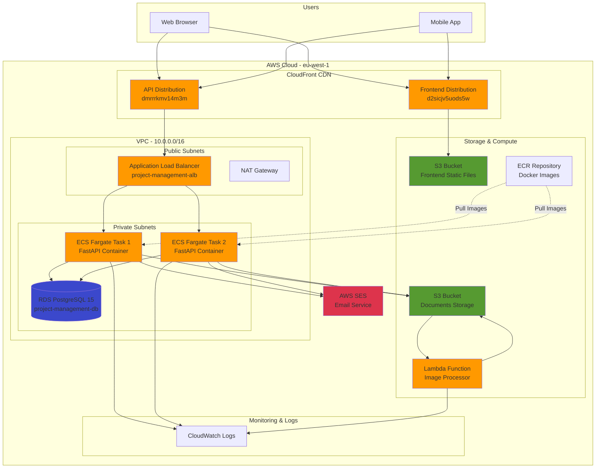

# Project Management API - React + FastAPI
[](https://github.com/Zahkklm/project_management/actions/workflows/ci-cd.yml)
[](https://codecov.io/gh/Zahkklm/project_management)

**Live Demo**: [https://d2sicjv5uods5w.cloudfront.net/login](https://d2sicjv5uods5w.cloudfront.net/login)

A full-stack project management system built with React and FastAPI, featuring document storage, user authentication, and project collaboration.

## Live Deployment

- **Frontend**: https://d2sicjv5uods5w.cloudfront.net
- **API**: https://dmrrrkmv14m3m.cloudfront.net
- **API Docs**: https://dmrrrkmv14m3m.cloudfront.net/docs
- **ALB**: http://project-management-alb-942012392.eu-west-1.elb.amazonaws.com
- **Postman Collection**: https://www.postman.com/workspace/My-Workspace~ec53562f-b09d-4deb-851e-c2a71a34a647/collection/19612596-aebefa66-4fe5-4585-9d85-4088df55272f?action=share&creator=19612596

## Architecture

### AWS Infrastructure Diagram



### System Architecture

```
┌─────────────────────────────────────────────────────────────────┐
│                         Internet Users                          │
└────────────────────────┬────────────────────────────────────────┘
                         │
                         ▼
         ┌───────────────────────────────────┐
         │   CloudFront (HTTPS)              │
         │   - Frontend: d2sicjv5uods5w      │
         │   - API: dmrrrkmv14m3m            │
         └───────┬───────────────────┬───────┘
                 │                   │
        ┌────────▼────────┐   ┌──────▼──────────┐
        │   S3 Bucket     │   │  ALB (HTTP)     │
        │   Frontend      │   │  Port 80        │
        └─────────────────┘   └────────┬────────┘
                                       │
                    ┌──────────────────┼──────────────────┐
                    │                  │                  │
            ┌───────▼────────┐ ┌──────▼────────┐ ┌──────▼────────┐
            │  ECS Fargate   │ │  ECS Fargate  │ │  ECS Fargate  │
            │  Task 1        │ │  Task 2       │ │  Task N       │
            │  (FastAPI)     │ │  (FastAPI)    │ │  (FastAPI)    │
            └───┬────────┬───┘ └───┬───────┬───┘ └───┬───────┬───┘
                │        │         │       │         │       │
                │        └─────────┼───────┼─────────┘       │
                │                  │       │                 │
        ┌───────▼────────┐  ┌──────▼───────▼──────┐  ┌──────▼──────┐
        │  RDS PostgreSQL│  │   S3 Documents      │  │  AWS SES    │
        │  (Private)     │  │   Bucket            │  │  (Email)    │
        └────────────────┘  └──────┬──────────────┘  └─────────────┘
                                   │
                            ┌──────▼──────────┐
                            │  Lambda         │
                            │  Image Resize   │
                            └─────────────────┘
```

### Component Details

| Component | Type | Purpose |
|-----------|------|----------|
| **CloudFront** | CDN | HTTPS termination, global content delivery |
| **ALB** | Load Balancer | Distributes traffic across ECS tasks |
| **ECS Fargate** | Compute | Runs FastAPI containers (256 CPU, 512 MB) |
| **RDS PostgreSQL** | Database | Stores users, projects, documents metadata |
| **S3** | Storage | Document files + Frontend static files |
| **Lambda** | Serverless | Automatic image resizing on upload |
| **SES** | Email | Sends project invitation emails |
| **ECR** | Registry | Stores Docker images |
| **CloudWatch** | Monitoring | Logs and metrics collection |

### Data Flow

1. **User Authentication**:
   ```
   User → CloudFront → ALB → ECS (FastAPI) → RDS → JWT Token
   ```

2. **Document Upload**:
   ```
   User → CloudFront → ALB → ECS → S3 → Lambda (resize) → S3
   ```

3. **Project Invitation**:
   ```
   User → CloudFront → ALB → ECS → SES → Email → Recipient
   ```

## Features

- **User Authentication**: JWT-based authentication with 1-hour token expiration
- **Project Management**: Create, update, delete, and share projects
- **Document Management**: Upload, download, update, and delete documents (PDF, DOCX)
- **Access Control**: Owner and participant roles with different permissions
- **Email Invitations**: AWS SES integration for sending project invitations
- **AWS S3 Integration**: Secure document storage with versioning
- **PostgreSQL Database**: Robust data persistence with SQLAlchemy ORM
- **AWS Lambda**: Automated image processing on upload
- **Docker Support**: Containerized application with docker-compose
- **CI/CD Pipeline**: Automated testing, building, and deployment

## Tech Stack

### Backend
- **Framework**: Python 3.10, FastAPI
- **Database**: PostgreSQL 15
- **ORM**: SQLAlchemy 2.0
- **Authentication**: JWT (python-jose)
- **Storage**: AWS S3 (boto3)
- **Validation**: Pydantic v2
- **Testing**: pytest, pytest-asyncio
- **CI/CD**: GitHub Actions
- **Containerization**: Docker, docker-compose

### Frontend
- **Framework**: React 18, TypeScript
- **Build Tool**: Vite
- **Routing**: React Router v6
- **State Management**: Zustand, TanStack Query
- **HTTP Client**: Axios
- **Styling**: Inline CSS (minimal)
- **Containerization**: Docker, Nginx

## Project Structure

```
project_management/
├── app/                  # Backend (FastAPI)
│   ├── api/              # API endpoints
│   │   ├── auth.py       # Authentication endpoints
│   │   ├── projects.py   # Project management endpoints
│   │   └── documents.py  # Document management endpoints
│   ├── core/             # Core functionality
│   │   ├── config.py     # Configuration settings
│   │   ├── database.py   # Database connection
│   │   └── security.py   # Security utilities
│   ├── models/           # SQLAlchemy models
│   ├── schemas/          # Pydantic schemas
│   ├── services/         # Business logic
│   └── main.py           # FastAPI application
├── frontend/             # Frontend (React + Vite)
│   ├── src/
│   │   ├── api/          # API client
│   │   ├── components/   # React components
│   │   ├── pages/        # Page components
│   │   ├── hooks/        # Custom hooks
│   │   ├── store/        # State management
│   │   └── types/        # TypeScript types
│   ├── Dockerfile
│   └── package.json
├── tests/                # Test suite
├── alembic/              # Database migrations
├── .github/workflows/    # CI/CD pipelines
├── docker-compose.yml
└── requirements.txt
```

## Setup

### Prerequisites

- Python 3.10+
- PostgreSQL 15+
- AWS Account (for S3)
- Docker & Docker Compose (optional)

### Local Development

1. **Clone the repository**
   ```bash
   git clone <repository-url>
   cd project_management
   ```

2. **Create virtual environment**
   ```bash
   python -m venv venv
   source venv/bin/activate  # On Windows: venv\Scripts\activate
   ```

3. **Install dependencies**
   ```bash
   pip install -r requirements.txt
   ```

4. **Configure environment variables**
   ```bash
   cp .env.example .env
   # Edit .env with your configuration
   ```

5. **Run database migrations**
   ```bash
   alembic upgrade head
   ```

6. **Start the application**
   ```bash
   uvicorn app.main:app --reload
   ```

### Docker Setup

1. **Configure environment variables**
   ```bash
   cp .env.example .env
   # Edit .env with your AWS credentials
   ```

2. **Install frontend dependencies**
   ```bash
   cd frontend
   npm install
   cd ..
   ```

3. **Start services**
   ```bash
   docker-compose up -d
   ```

4. **Access the application**
   - Frontend: http://localhost:3000
   - API: http://localhost:8000
   - API Docs: http://localhost:8000/docs

For detailed frontend setup, see [FRONTEND_SETUP.md](FRONTEND_SETUP.md)

## API Endpoints

### Authentication
- `POST /auth` - Create user account
- `POST /login` - Login and get JWT token

### Projects
- `POST /projects` - Create new project
- `GET /projects` - Get all accessible projects
- `GET /project/{project_id}/info` - Get project details
- `PUT /project/{project_id}/info` - Update project details
- `DELETE /project/{project_id}` - Delete project (owner only)
- `POST /project/{project_id}/invite?user={login}` - Invite user to project
- `GET /project/{project_id}/share?with_email={email}` - Send email invitation
- `POST /join?token={token}&project_id={id}` - Join project via invitation link

### Documents
- `GET /project/{project_id}/documents` - Get all project documents
- `POST /project/{project_id}/documents` - Upload documents
- `GET /document/{document_id}` - Download document
- `PUT /document/{document_id}` - Update document
- `DELETE /document/{document_id}` - Delete document

## Testing

```bash
# Run all tests
pytest

# Run with coverage
pytest --cov=app --cov-report=html

# Run specific test file
pytest tests/test_auth.py -v
```

## CI/CD Pipeline

The GitHub Actions workflow includes:

1. **Linting**: Black, isort, Flake8
2. **Testing**: pytest with coverage reporting (85 tests, 84% coverage)
3. **Building**: Docker image build and push to Amazon ECR
4. **Deployment**: Automated deployment to AWS ECS on merge to main

See [GitHub Secrets Configuration](.github/SECRETS.md) for setup instructions.

## AWS Deployment

The application is deployed to AWS using Terraform with the following infrastructure:

- **ECS Fargate**: Serverless container orchestration
- **Application Load Balancer**: Traffic distribution
- **RDS PostgreSQL**: Managed database
- **S3**: Document storage with versioning
- **Lambda**: Image processing
- **SES**: Email service for invitations
- **VPC**: Isolated network with public/private subnets

See [AWS Deployment Guide](AWS_DEPLOYMENT.md) for complete deployment instructions.

## Database Migrations

```bash
# Create new migration
alembic revision --autogenerate -m "description"

# Apply migrations
alembic upgrade head

# Rollback migration
alembic downgrade -1
```

## AWS Lambda for Image Processing

Create a Lambda function for S3 event triggers:

```python
# lambda_function.py
import boto3
from PIL import Image
import io

s3 = boto3.client('s3')

def lambda_handler(event, context):
    bucket = event['Records'][0]['s3']['bucket']['name']
    key = event['Records'][0]['s3']['object']['key']
    
    # Download image
    response = s3.get_object(Bucket=bucket, Key=key)
    image = Image.open(response['Body'])
    
    # Resize image
    image.thumbnail((800, 800))
    
    # Upload resized image
    buffer = io.BytesIO()
    image.save(buffer, format='JPEG')
    buffer.seek(0)
    
    s3.put_object(
        Bucket=bucket,
        Key=f"resized/{key}",
        Body=buffer
    )
    
    return {'statusCode': 200}
```


## Data Normalization & Denormalization

### Normalization
The database schema is normalized for efficient storage and integrity:
- **Users**: Each user is stored once in the `user` table.
- **Projects**: Each project is stored in the `project` table, with an `owner_id` foreign key.
- **Documents**: Each document is stored in the `document` table, linked to a project via `project_id`.
- **Access Control**: The `project_access` table links users to projects with roles (owner/participant).

This approach avoids data duplication and ensures referential integrity.

### Denormalization
If required for performance (e.g., reporting, analytics), denormalized views or tables can be added. For example:
- Caching document counts per project
- Storing user/project summary info in a reporting table

Currently, all API responses are normalized, but denormalization can be added as needed for specific use cases.

## License

MIT License
